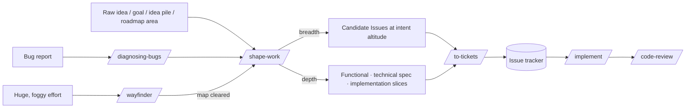

<p align="center">
  
</p>

<h1 align="center">My Agent Skills</h1>

<p align="center">
  Small, sharp workflows for getting useful work out of coding agents.
  <br />
  Not a spec factory. Not a prompt dump. A little spellbook for repeatable agent work.
</p>

<p align="center">
  <a href="#install"><strong>Install</strong></a> ·
  <a href="#the-big-opinion"><strong>Opinion</strong></a> ·
  <a href="#delivery-workflow"><strong>Workflow</strong></a> ·
  <a href="#skill-index"><strong>Skill index</strong></a>
</p>

---

This is my personal collection of agent skills — slash commands and model-invoked behaviours used by Claude Code and other Agent-Skills-standard harnesses.

The goal is to capture the workflows I actually want agents to follow: grill the plan, shape the work at the right altitude, keep domain language sharp, run TDD when it helps, review against both standards and spec, and leave the repo easier for the next agent to understand.

## The big opinion

Most agent workflows jump too quickly to implementation artifacts. This repo pushes back.

- **Start with the outcome, not the document.** A goal, idea pile, roadmap area, or bug cluster can become shaped Candidate Issues before anyone writes a spec.
- **Keep altitude clean.** Work lives at one of four altitudes — **intent** (Candidate Issues), **functional** (the Issue's functional description), **technical** (the spec), and **implementation slices** (Sub-issues). Deepen work in place; don't smear one altitude's concerns onto another. A missing lower altitude is fine — not every Issue needs a spec.
- **Separate alignment from publishing.** `/shape-work` interviews you and aligns the work at whatever altitude; `/to-tickets` is the thin publisher that writes it to the tracker. The split keeps goal-gradient pressure from corrupting the thinking.
- **Prefer durable vocabulary.** The skills share terms like Intent, Functional description, Spec, Acceptance criteria, Complexity, Uncertainty, Module, Interface, Seam, Depth, Leverage, and Locality — and pause for an **Interface checkpoint** before a material interface hardens.
- **Treat skills as process, not magic.** A good skill makes the agent take the same *kind* of path every run, even if the answer changes.

## Delivery workflow

You do **not** have to start from a spec. Work enters through a raw idea, goal, roadmap area, bug cluster, or existing Issue — and `/shape-work` takes it only as deep as it needs to go.



Altitude is a property of the work, deepened in place. One aligner shapes it, one publisher persists it:

| Altitude | Carried by | Shaped by (`/shape-work`) | Published by (`/to-tickets`) |
| --- | --- | --- | --- |
| Intent | an Issue's title + intent | breadth | one or more intent-altitude Issues |
| Functional | the Issue's functional description | depth → functional | one functional Issue |
| Technical | a spec attached to the Issue | depth → technical | an Issue + its spec |
| Implementation slices | Sub-issues (vertical slices) | depth → slices | Sub-issues wired with blocking edges |

`/wayfinder` sits above all of this for efforts too big for one session — a greenfield project or a huge build, where the way to the destination isn't visible yet. It charts the unknowns as decision tickets and resolves them one at a time, over as many sessions as it takes, producing decisions rather than deliverables. Save it for the idea you can't hold in one session; a well-scoped feature starts at `/shape-work`.

A cleared map has no open decisions left, so it enters `/shape-work` as settled input: breadth first, into one or more intent-altitude Issues, then depth on any single one that needs a functional description or a spec. That collapse is mostly synthesis — the grilling is aimed only at what the map left open, and a question big enough that the map should have settled it goes back to `/wayfinder`, so the decision lands on the map rather than buried in a spec.

### 1. Install the skills into your agent

Install straight from GitHub with the [`skills`](https://skills.sh) CLI — it copies the selected skills into your agent's skill directory:

```bash
# add the whole collection — pick skills + agents interactively
npx skills@latest add biellls/my-skills

# …or a single skill by its path
npx skills@latest add biellls/my-skills/skills/engineering/tdd

# target specific agents, or install globally
npx skills@latest add biellls/my-skills --agent claude-code cursor
npx skills@latest add biellls/my-skills -g
```

`npx skills list` shows what's installed; `npx skills update` pulls the latest; `npx skills rm biellls/my-skills` removes it.

### 2. Set up each repo you use them in

The engineering skills assume a small amount of per-repo configuration — which issue tracker to use, the triage label vocabulary, the project's development stage, the domain-doc layout, and the planning altitudes. Run **once per repo**:

```
/setup-skills
```

It interviews you, then writes the config under `docs/agents/` and adds an `## Agent skills` pointer block to the repo's `CLAUDE.md` (or `AGENTS.md`):

| File | What it holds |
| --- | --- |
| `docs/agents/issue-tracker.md` | Where Issues live and how skills read/write them (GitHub, GitLab, or local markdown). |
| `docs/agents/triage-labels.md` | The triage role → label-string mapping (only when `triage` is installed). |
| `docs/agents/project-lifecycle.md` | The repo's **Project development stage** (`prototype` / `beta` / `stable`) as trade-off context. |
| `docs/agents/domain.md` | Domain-doc layout (`CONTEXT.md` + ADRs) and the consumer rules for reading them. |
| `docs/agents/altitudes.md` | The four planning altitudes and which artifact carries each, plus per-altitude house shapes (`intent.md`, `functional-issues.md`, `technical.md`, `implementation-slices.md`). |

Everything is plain markdown — edit `docs/agents/*.md` directly afterwards. Re-running the skill is only needed to switch trackers, change the project stage, or start over.

## Skill index

### In progress ([`skills/in-progress`](./skills/in-progress/README.md))

Runnable prototypes and experiments not yet promoted to a daily bucket.

#### Model-invoked

| Skill | Use it to |
| --- | --- |
| [`sketchpad`](./skills/in-progress/sketchpad/SKILL.md) | Explore an idea in a local browser workspace with anchored human/agent comments and a durable CLI wait/reply loop. |

### Engineering ([`skills/engineering`](./skills/engineering/README.md))

Daily code work: shaping, publishing, implementation, architecture, review, debugging, research, and delivery.

#### User-invoked

Reachable only when explicitly requested.

| Skill | Use it to |
| --- | --- |
| [`shape-work`](./skills/engineering/shape-work/SKILL.md) | Shape work by breadth (Candidate Issues at intent altitude) or by depth (grill the functional and technical altitudes one at a time, then derive implementation slices from the aligned descriptions). Aligns only. |
| [`to-tickets`](./skills/engineering/to-tickets/SKILL.md) | Publish what `/shape-work` aligned to the tracker at whatever altitude it reached — Issues, a functional Issue, an Issue + spec, or an Issue + spec + Sub-issue slices. |
| [`implement`](./skills/engineering/implement/SKILL.md) | Build the work described by a spec or set of tickets, driving `/tdd` at agreed seams and closing out with `/code-review`. |
| [`wayfinder`](./skills/engineering/wayfinder/SKILL.md) | Plan a huge, foggy effort as a shared map of decision tickets, resolved one at a time until the way to the destination is clear. |
| [`improve-codebase-architecture`](./skills/engineering/improve-codebase-architecture/SKILL.md) | Scan a codebase for deepening opportunities, present them as a visual HTML report, then grill through your pick. |
| [`triage`](./skills/engineering/triage/SKILL.md) | Move Issues (and optionally external PRs) through a state machine of triage roles. |
| [`setup-skills`](./skills/engineering/setup-skills/SKILL.md) | Configure a repo for these engineering skills: issue tracker, triage labels, project lifecycle, altitudes, and domain docs. Run once per repo. |

#### Model-invoked

Model- or user-reachable when the situation calls for them.

| Skill | Use it to |
| --- | --- |
| [`code-review`](./skills/engineering/code-review/SKILL.md) | Review a diff along two axes: standards and spec fidelity, run as parallel sub-agents. |
| [`codebase-design`](./skills/engineering/codebase-design/SKILL.md) | Apply the shared deep-module vocabulary (Module, Interface, Seam, Depth, Leverage, Locality) and run Interface checkpoints before an interface hardens. |
| [`delegate`](./skills/engineering/delegate/SKILL.md) | Orchestrate worthwhile background agents through the Herdr-backed Delegate extension, with status UI and isolated writer worktrees. |
| [`diagnosing-bugs`](./skills/engineering/diagnosing-bugs/SKILL.md) | Build a tight reproduce → minimise → hypothesise → fix loop for hard bugs and performance regressions. |
| [`domain-modeling`](./skills/engineering/domain-modeling/SKILL.md) | Sharpen project terminology, stress-test domain concepts, and update `CONTEXT.md` / ADRs inline. |
| [`prototype`](./skills/engineering/prototype/SKILL.md) | Build a throwaway prototype to answer a design, logic, state, or UI question. |
| [`research`](./skills/engineering/research/SKILL.md) | Investigate a question against high-trust primary sources and capture cited findings in the repo. |
| [`resolving-merge-conflicts`](./skills/engineering/resolving-merge-conflicts/SKILL.md) | Resolve an in-progress git merge or rebase conflict without aborting. |
| [`tdd`](./skills/engineering/tdd/SKILL.md) | Develop with a red-green-refactor loop, one vertical slice and one agreed seam at a time. |

### Productivity ([`skills/productivity`](./skills/productivity/README.md))

Daily non-code workflows: pressure-testing decisions, handing work off, learning, and writing better skills.

#### User-invoked

Reachable only when explicitly requested.

| Skill | Use it to |
| --- | --- |
| [`grill-me`](./skills/productivity/grill-me/SKILL.md) | Get relentlessly interviewed about a plan or design until every branch is resolved. |
| [`handoff`](./skills/productivity/handoff/SKILL.md) | Compact the current conversation into a handoff document for another agent. |
| [`learn-with-conversation`](./skills/productivity/learn-with-conversation/SKILL.md) | Learn any topic through guided conversation, growing understanding one branch at a time from its root insight. |
| [`teach`](./skills/productivity/teach/SKILL.md) | Learn a new skill or concept over multiple sessions in a stateful workspace. |
| [`writing-great-skills`](./skills/productivity/writing-great-skills/SKILL.md) | Reference the vocabulary and principles for writing predictable skills. |

#### Model-invoked

Model- or user-reachable when the situation calls for them.

| Skill | Use it to |
| --- | --- |
| [`grilling`](./skills/productivity/grilling/SKILL.md) | Interview the user relentlessly about a plan or design until every branch is resolved. |

## Maintainer notes

Each skill lives in a bucket folder under `skills/` and contains a `SKILL.md` plus any files it owns. When adding, removing, or renaming skills:

1. update the bucket README,
2. update this README,
3. push — installs pull from GitHub, so consumers pick up the change with `npx skills update`.

The shared domain language for this repo lives in [`CONTEXT.md`](./CONTEXT.md), and the decision records in [`docs/adr/`](./docs/adr/) capture the lifecycle rationale.

## Credits

This repo started as an adaptation of [mattpocock/skills](https://github.com/mattpocock/skills) (MIT). It has since grown its own four-altitude planning model, issue vocabulary, and engineering opinions.

## License

MIT — see [LICENSE](./LICENSE).
